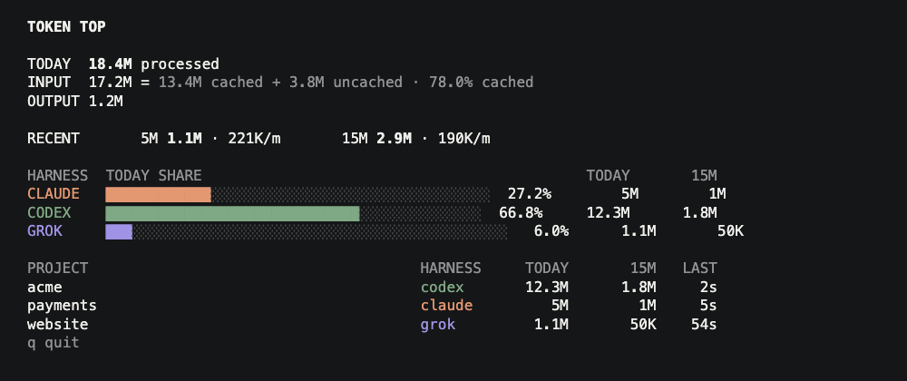

# Token Top

`top` for token usage across local Claude Code, Codex, and Grok sessions.

Open a terminal tab, glance, know what is burning.



```text
curl -fsSL https://raw.githubusercontent.com/markcmarshall/token-top/main/install.sh | sh
```

Installs the release binary into the first writable directory already on PATH (`/opt/homebrew/bin`, `/usr/local/bin`, or `~/.local/bin`). If none of those are on PATH, it writes `~/.local/bin` and prints the one export to add. Override with `PREFIX` or `VERSION`.

```text
go install github.com/markcmarshall/token-top/cmd/ttop@v1.0.1
```

For people who already install Go modules that way. It lands in `$(go env GOPATH)/bin`. Prebuilt binaries are also on the [releases](https://github.com/markcmarshall/token-top/releases) page.

## What it shows

Live trailing completed token usage for local agent sessions:

- 1-minute, 5-minute, and 15-minute burn
- which harness, model, and project owns each session
- input / output / cache composition
- whether the source telemetry is healthy enough to trust

Rates come from event timestamps in harness logs, not from screen refresh deltas. Tokens are directional workload counts, not money, quota, or normalized compute.

## Limitations

- Claude Code, Codex, and Grok only. No Windows, remote hosts, or custom log paths.
- Passive: `q` and Ctrl-C quit. No sorting, filters, drill-down, or session control.
- No cost, history, alerts, config file, daemon, or hosted service.
- Grok updates when a turn completes; missing update logs degrade that source instead of inventing zeros.
- First-render lifetime totals may show `~` while older files are still indexing.

## Privacy

`ttop` is local and read-only. It makes no network requests, stores no database, and sends no telemetry.

It reads only these default directories:

| Source | Paths |
| --- | --- |
| Claude Code | `~/.claude/projects/` |
| Codex | `~/.codex/sessions/`, `~/.codex/archived_sessions/` |
| Grok | `~/.grok/sessions/` |

Parsers extract identity, timestamp, model, CWD, and usage metadata. Prompt, completion, tool argument, and source-code content is never rendered, persisted, transmitted, or logged. Full absolute paths are not shown by default.

## Usage

```text
ttop
ttop --once
ttop --interval 2s --no-color
```

| Flag | Meaning |
| --- | --- |
| `--interval DURATION` | refresh interval; default `2s` |
| `--no-color` | disable ANSI color |
| `--once` | print one snapshot and exit |
| `--help` | usage |
| `--version` | build version |

On a TTY, `ttop` runs a live alternate-screen monitor. `q` or Ctrl-C quits and restores the terminal. Non-TTY stdout is a plain snapshot, equivalent to `--once --no-color`.

## Library

The Go module is the same engine as the binary. Supply an `attribution.Attributor` to label events; the default uses git root, then CWD basename.

```go
import "github.com/markcmarshall/token-top/ttop"

eng := ttop.New(ttop.Options{Attributor: myAttributor})
snap := ttop.Snapshot(ctx, ttop.Options{Attributor: myAttributor})
```

## Architecture

```text
source adapters
    ↓
token events
    ↓
event attribution
    ↓
session reducer
    ↓
immutable snapshot
    ↓
responsive renderer
```

## License

MIT. See [LICENSE](LICENSE).

Security reports: [SECURITY.md](SECURITY.md).
Contributions: [CONTRIBUTING.md](CONTRIBUTING.md).
